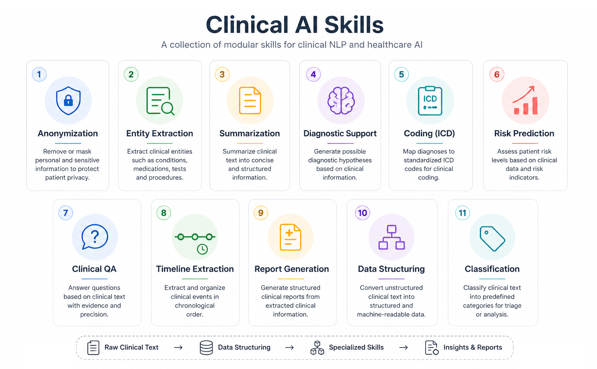

🌍 Language:
[English](README.md) | [Português](README.pt-BR.md) | [Español](README.es.md)

# Clinical Agent Skills



A curated collection of **reusable AI agent skills for clinical and healthcare applications**.

This repository provides modular building blocks designed to support real-world clinical workflows using Large Language Models (LLMs) combined with structured logic, validation, and domain-specific knowledge.

Instead of isolated prompts, each skill is designed as a **reliable, composable unit of behavior** — enabling the creation of robust clinical AI agents.

## What you'll find here

- **[Clinical Anonymization](./skills/anonymization/)**  
  Remove sensitive patient information (PHI) while preserving data utility.

- **[Entity Extraction (Clinical NER)](./skills/entity_extraction/)**  
  Identify diseases, medications, symptoms, and procedures from unstructured text.

- **[Clinical Summarization](./skills/summarization/)**  
  Transform long clinical notes into structured summaries (e.g., SOAP format).

- **[Diagnostic Support (Assistive)](./skills/diagnostic_support/)**  
  Suggest possible hypotheses based on patient data *(non-deterministic, assistive use only)*.

- **[Clinical Coding (ICD/CID)](./skills/coding_icd/)**  
  Map clinical text to standardized medical codes.

- **[Risk Prediction](./skills/risk_prediction/)**  
  Assess patient risk levels based on clinical data.

- **[Clinical Question Answering](./skills/clinical_qa/)**  
  Answer questions grounded in patient records.

- **[Timeline Extraction](./skills/timeline_extraction/)**  
  Reconstruct patient history into chronological events.

- **[Report Generation](./skills/report_generation/)**  
  Generate structured clinical reports.

- **[Data Structuring](./skills/data_structuring/)**  
  Convert free-text clinical notes into structured JSON.

- **[Clinical Classification](./skills/classification/)**  
  Assess severity, urgency, or risk levels.

## 🧠 What is a "Skill"?

A **skill** is more than a prompt.

It is a **task-oriented, reusable module** that may include:

- LLM prompting  
- Pre-processing and post-processing  
- Validation rules  
- Structured outputs (e.g., JSON)  
- Optional integration with medical ontologies (e.g., ICD, SNOMED)

Each skill is designed to be:

- ✔️ Reusable  
- ✔️ Composable  
- ✔️ Testable  

If you want a deeper dive into the concept of AI agent skills, check out this repository: 
 
👉 https://github.com/elisaterumi-ai/agent-skills-in-practice

## Design Principles

- Reliability over raw generation  
- Structured outputs over free text  
- Assistive AI, not autonomous diagnosis  
- Privacy-first (LGPD/HIPAA-aware)  
- Evaluation-driven development  

## Repository Structure

```
/skills
  /anonymization
  /entity_extraction
  /summarization
  /diagnostic_support
  /coding_icd
  /risk_prediction
  /clinical_qa
  /timeline_extraction
  /report_generation
  /data_structuring
  /classification
```

## Disclaimer

This repository is intended for **research and development purposes only**.

The skills provided here are **assistive tools** and must not be used as a substitute for professional medical judgment, diagnosis, or treatment.

## Vision

To build a practical foundation for **clinical AI agents that are safe, modular, and grounded in real-world healthcare needs** — bridging the gap between experimental LLM demos and production-ready medical AI systems.

## 🤝 Contributing

Contributions are welcome!

You can:
- Add new clinical skills  
- Improve prompts and pipelines  
- Provide evaluation datasets  
- Suggest benchmarks and metrics  

## 🔗 Connect with me

I share practical insights about AI, agents, and real-world applications:

- LinkedIn (Profile): https://www.linkedin.com/in/elisa-terumi  
- LinkedIn (Page): https://www.linkedin.com/company/exploring-artificial-intelligence  
- Newsletter: https://exploringartificialintelligence.substack.com/  
- Medium: https://medium.com/@elisa-terumi

## Star History

<a href="https://www.star-history.com/?repos=elisaterumi-ai%2Fagent-skills-in-practice&type=date&legend=top-left">
 <picture>
   <source media="(prefers-color-scheme: dark)" srcset="https://api.star-history.com/chart?repos=elisaterumi-ai/agent-skills-in-practice&type=date&theme=dark&legend=top-left" />
   <source media="(prefers-color-scheme: light)" srcset="https://api.star-history.com/chart?repos=elisaterumi-ai/agent-skills-in-practice&type=date&legend=top-left" />
   
 </picture>
</a>
